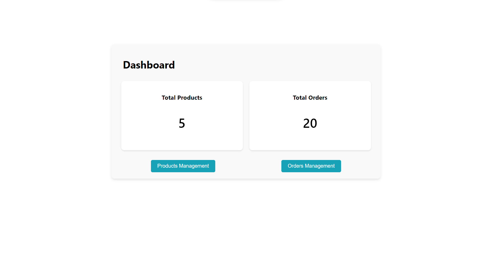
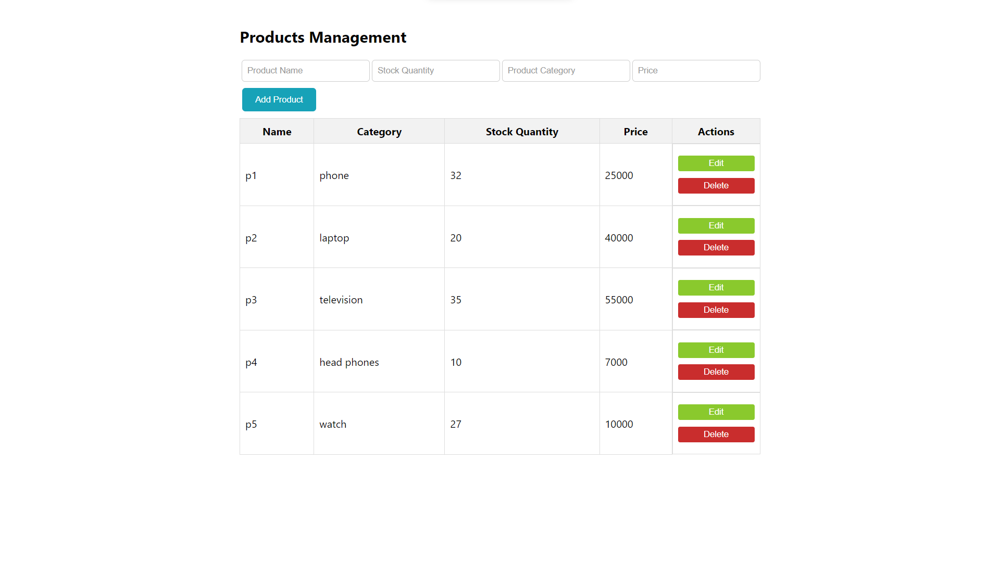
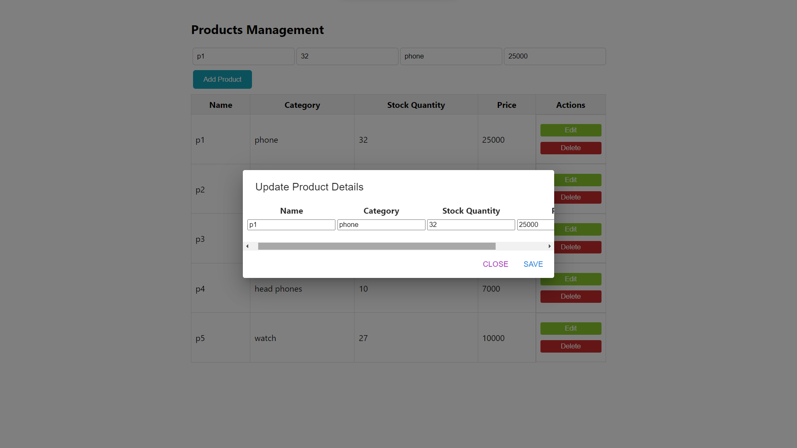
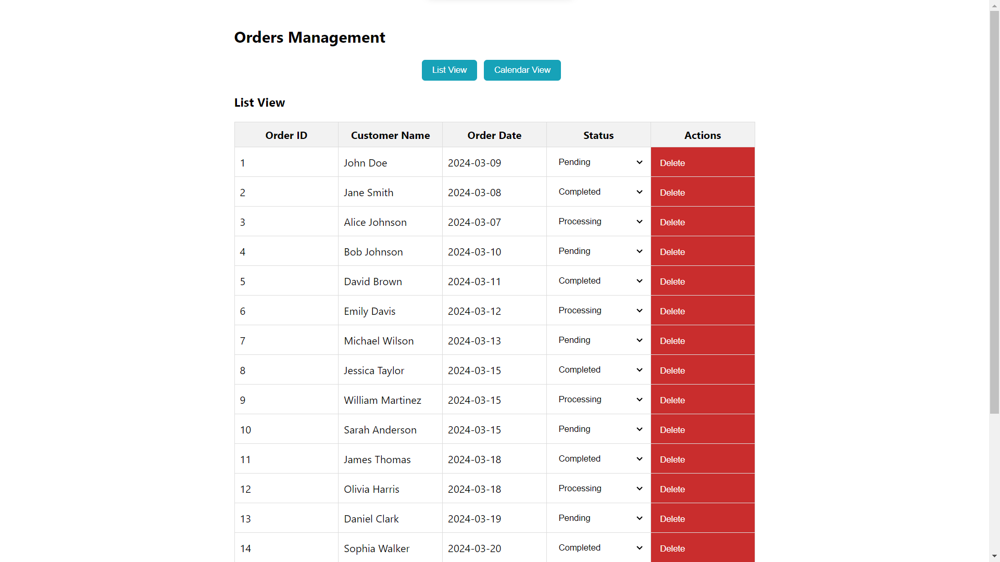
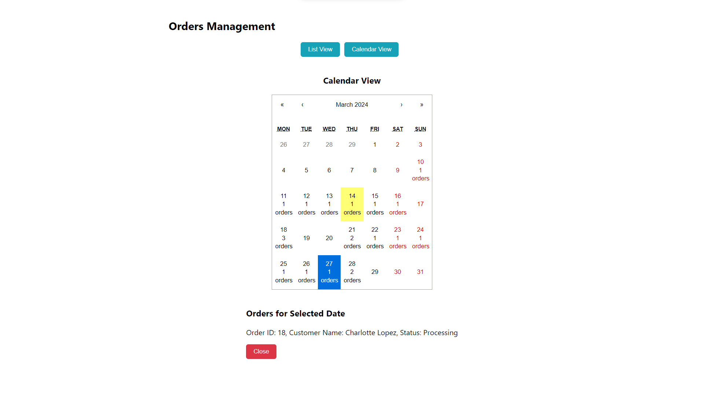

# Simplified ERP System Documentation
Welcome to the Simplified ERP System. This documentation will help you in navigating and utilizing the various features of this ERP system.

## Accessing the System
You can access the ERP system through the following URL: Simplified ERP System

## Getting Started
No setup is necessary as the system is hosted on Vercel. Simply click the provided URL to begin using the ERP system.

# Exploring the Interface
The ERP system offers several key functionalities:

## Overview Dashboard
Gain insights into essential metrics and features of the ERP system. Here, you'll find summaries of product and order statistics, along with quick links to manage products and orders.

## Product Management
Effortlessly manage product listings with options to view, add, edit, and delete products. Product details such as name, category, price, and stock quantity are readily available.

## Order Management
Handle orders efficiently by viewing, updating, and deleting them as needed. Details including order ID, customer name, order date, and status are displayed for quick reference.

## Calendar View
Experience an alternative visualization of orders with calendar view. Orders are organized based on their expected delivery dates.

## Key Features
Seamless Navigation: Enjoy a smooth user experience with React Router facilitating navigation between different sections.
Responsive Interface: Our website adapts to various screen sizes, ensuring optimal usability across devices.

## Additional Information
Mock Data: The system utilizes mock data for demonstration purposes.
Optional Features: The calendar view provides an alternative perspective on order management.

